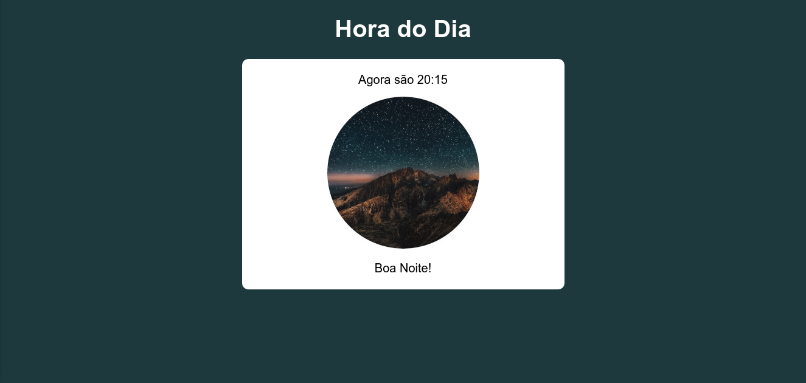

# hora_do_dia

    

 
 

    

 

    

## Description

Uma aplicação que muda a interface de acordo com o horário fornecido pelo computador.
Aplicação feita como exercício do curso de JavaScript do Curso em Vídeo
 
